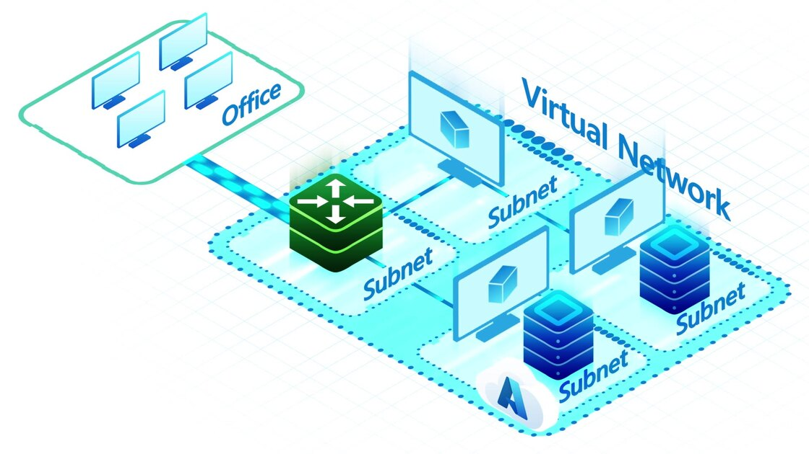

# Azure Networking

  ## Networking foundation :
   ### Azure networking foundation services are :

   1. Virtual Networks (VNet)
   2. Private Link 
   3. Azure DNS 
   4. Azure Bastion
   5. Route Server
   6. NAT Gateway
   7. Trafic Manager

### Virtual network
Azure Virtual Network (VNet) is the fundamental building block for your private network in
Azure.
#### You can use VNets to:
1. Communicate between Azure resources: You can deploy virtual machines, and several other types of Azure resources to a virtual network, such as Azure App Service Environments, the Azure Kubernetes Service (AKS), and Azure Virtual Machine Scale Sets.
1. Communicate between each other: You can connect virtual networks to each other,enabling resources in either virtual network to communicate with each other, using virtual network peering or Azure Virtual Network Manager. 
3. The virtual networks you connect can be in the same, or different, Azure regions. For more information, see Virtual network peering and Azure Virtual Network Manager.
4. Communicate to the internet: All resources in a virtual network can communicate outbound to the internet, by default. You can communicate inbound to a resource by assigning a public IP address or a public Load Balancer.
5. You can also use Public IP addresses or public Load Balancer to manage your outbound connections.
6. Communicate with on-premises networks: You can connect your on-premises computers and networks to a virtual network using VPN Gateway or ExpressRoute.
7. Encrypt traffic between resources: You can use Virtual network encryption to encrypt traffic between resources in a virtual network.
8. Network security groups : You can filter network traffic to and from Azure resources in an Azure virtual network with a network security group. 
9. Service endpoints : Virtual Network (VNet) service endpoints extend your virtual network private address space and the identity of your virtual network to the Azure services, over a direct connection.
10. Endpoints allow you to secure your critical Azure service resources to only your virtual networks. Traffic from your virtual network to the Azure service always remains on the Microsoft Azure backbone network
#### VNet
  Azure Virtual Network provides the fundamental building block for your private network in Azure. This service enables Azure resources like virtual machines (VMs) to securely communicate with each other, the internet, and on-premises networks. Virtual networks deliver the scale, availability, and *isolation benefits of Azure infrastructure*  while maintaining the familiar networking concepts you use in traditional datacenters.

  

  ##### Usegaes :

  1. Communication of Azure resources with the internet.
  2. Communication between Azure resources.
  3. Communication with on-premises resources.
  4. Filtering of network traffic.
  5. Routing of network traffic.
  6. Integration with Azure services.

##### Communicate with the internet

  1. All resources in a virtual network can communicate outbound with the internet, by default. 
  2. You can also use a public IP address, NAT gateway, or public load balancer to manage your outbound connections.
  3. You can communicate inbound with a resource by assigning a public IP address or a public load balancer.

 When you're using only an internal standard load balancer, outbound connectivity isn't available until you define how you want outbound connections to work with an instance-level public IP address or a public load balancer.

###### Communicate between Azure resources
 Azure resources communicate securely with each other in one of the following ways:

###### Virtual network:
 You can deploy VMs and other types of Azure resources in a virtual network. Examples of resources include App Service Environments, Azure Kubernetes Service (AKS), and Azure Virtual Machine Scale Sets. 
 
###### Note
 To move a virtual machine from one virtual network to another, you must delete and recreate the virtual machine in the new virtual network. The virtual machine's disks can be retained for use in the new virtual machine.

###### Virtual network service endpoint: 
 1. You can extend your virtual network's private address space and the identity of your virtual network to Azure service resources over a direct connection.
 2. Examples of resources include Azure Storage accounts and Azure SQL Database. 
 3. Service endpoints allow you to secure your critical Azure service resources to only a virtual network. 

###### Virtual network peering:
 You can connect virtual networks to each other by using virtual peering. The resources in either virtual network can then communicate with each other. The virtual networks that you connect can be in the same, or different, Azure regions. 
###### Communicate with on-premises resources
 You can connect your on-premises computers and networks to a virtual network by using any of the following options:

**Point-to-site virtual private network (VPN)**: 
 Established between a virtual network and a single computer in your network. Each computer that wants to establish connectivity with a virtual network must configure its connection. This connection type is useful if you're just getting started with Azure, or for developers, because it requires few or no changes to an existing network. The communication between your computer and a virtual network is sent through an encrypted tunnel over the internet. To learn more, see About point-to-site VPN.

**Site-to-site VPN**:
 Established between your on-premises VPN device and an Azure VPN gateway deployed in a virtual network. This connection type enables any on-premises resource that you authorize to access a virtual network. The communication between your on-premises VPN device and an Azure VPN gateway is sent through an encrypted tunnel over the internet. To learn more, see Site-to-site VPN.

***Azure ExpressRoute**:
 Established between your network and Azure, through an ExpressRoute partner. This connection is private. Traffic doesn't go over the internet. To learn more, see What is Azure ExpressRoute?.

###### Filter network traffic
 You can filter network traffic between subnets by using either or both of the following options:

**Network security groups**: 
 Network security groups and application security groups can contain multiple inbound and outbound security rules. These rules enable you to filter traffic to and from resources by source and destination IP address, port, and protocol. To learn more, see Network security groups and Application security groups.

**Network virtual appliances**:
  A network virtual appliance is a virtual machine that performs a network function, such as a firewall or WAN optimization. To view a list of available network virtual appliances that you can deploy in a virtual network, go to Azure Marketplace.

###### Route network traffic
 Azure routes traffic between subnets, connected virtual networks, on-premises networks, and the internet, by default. You can implement either or both of the following options to override the default routes that Azure creates:

**Route tables**:
 You can create custom route tables that control where traffic is routed to for each subnet.

**Border gateway protocol (BGP) routes**:
 If you connect your virtual network to your on-premises network by using an Azure VPN gateway or an ExpressRoute connection, you can propagate your on-premises BGP routes to your virtual networks.

###### Integrate with Azure services
 1. Integrating Azure services with an Azure virtual network enables private access to the service from virtual machines or compute resources in the virtual network. You can use the following options for this integration:
 2. Deploy dedicated instances of the service into a virtual network. The services can then be privately accessed within the virtual network and from on-premises networks.
 3. Use Azure Private Link to privately access a specific instance of the service from your virtual network and from on-premises networks.

4. Access the service over public endpoints by extending a virtual network to the service, through service endpoints. Service endpoints allow service resources to be secured to the virtual network.

###### Limits
There are limits to the number of Azure resources that you can deploy. Most Azure networking limits are at the maximum values. However, you can increase certain networking limits. For more information, see Networking limits.

###### Virtual networks and availability zones
Virtual networks and subnets span all availability zones in a region. You don't need to divide them by availability zones to accommodate zonal resources. For example, if you configure a zonal VM, you don't have to take into consideration the virtual network when selecting the availability zone for the VM. The same is true for other zonal resources

#### Next Day :
https://learn.microsoft.com/en-us/azure/virtual-network/virtual-networks-overview#next-steps


#### Network security groups
#### Serice endpoints 
#### Azure private link
#### Azure DNS
#### Azure Bastion
#### Azure route server
#### NAT Gateway 
#### Trafic Manager 

  ## Load Balancing && Content Delivery
   ###  Services allow for management, distribution, and optimization of your applications and workloads
   1. Load Balancer 
   2. Application Gateway
   3. Azure Front Door
  ## Hybrid Connectivity 
   ### Azure hybrid connectivity services secure communication to and from your resources in Azure
   1. VPN Gateway
   2. Express Route
   3. Virtual WAN
   4. Peering Services 
  ## Network security 
   ### Network security services protect your web applications and IaaS services from DDoS attacks and Malicious actors
   1. Firewal Manager
   2. Firewal,
   3. Web Application firewall
   4. DDoS Protection 
  ## Networking management and monitoring 
   ### Networing management and moniotoring services provides tools to manage and monitor your network resources 
   1. Netwrok watcher
   2. Azure Monitor 
   3. Azure network manager 

# Virtual Networking 
1. **VNets**  
2. **Subnets**  
3. **Peering**  
4. **DNS**  
5. **VPN Gateway**  
6. **ExpressRoute**  
7. **Public / Private Endpoints**  
8. **Network Security Groups**  
9. **Load Balancers (Basics)**  
10. **Refer : https://learn.microsoft.com/pdf?url=https%3A%2F%2Flearn.microsoft.com%2Fen-us%2Fazure%2Fnetworking%2Ffundamentals%2Ftoc.json**

## VNets (Virtual Networks)

## Azure Firewall 

Azure Firewall is a managed, cloud-native network security service that controls and inspects traffic going in and out of your Azure virtual network (VNet). It acts as a central security gate that determines which traffic is allowed, on which ports, and to which destinations.

### Azure Firewall — Core Components

| Component               | Purpose                                   |
| ----------------------- | ----------------------------------------- |
| **Firewall Rules**      | Allow or deny traffic                     |
| **Application Rules**   | Control HTTP/HTTPS traffic (FQDN-based)   |
| **Network Rules**       | Control IP/Port-based traffic             |
| **NAT Rules**           | Publish internal services to the internet |
| **Threat Intelligence** | Blocks known malicious IPs                |

### Typical Flow
Your PC → Firewall Public IP → DNAT → VM Private IP → SSH

### Route Table (UDR)
To ensure traffic is inspected by Azure Firewall, create a User Defined Route (UDR) on the VM subnet that directs outbound traffic to the firewall's private IP.

- **Route Example:**
   - Destination: 0.0.0.0/0
   - Next Hop Type: Virtual Appliance
   - Next Hop Address: `<Firewall Private IP>`

This forces:
VM → Azure Firewall → Internet

### Why UDR is Required for Azure Firewall

1. **Security Enforcement**  
    - Firewall rules apply only if traffic passes through the firewall.  
    - Without a UDR, VMs can reach the internet directly and firewall rules are ignored.

2. **Centralized Control**  
    - One firewall can protect multiple subnets.  
    - Central place to manage outbound rules and logs.

3. **Compliance & Auditing**  
    - Logs for outbound traffic are consolidated.  
    - Useful for regulated environments (PCI, ISO).

4. **Prevent Firewall Bypass**  
    - Without UDRs, a user could assign a Public IP to a VM and bypass the firewall.

### Example Architecture (ASCII)

```
VM Subnet
   |
   | (UDR: 0.0.0.0/0 → Firewall private IP)
   ↓
Azure Firewall
   |
Internet
```

**Firewall Configuration:**
- Firewall Policy → Firewall Rules / NAT Rules  
- DNAT Example: Any IP (*) → Firewall Public IP → VM Private IP

**Recommended High-Level Topologies (Choose One)**

**Option A — Firewall in Front (Perimeter Control)**
```
Internet → Azure Firewall (Public) → DNAT → Application Gateway (Internal) → Internal Load Balancer → VM Backend Pool
```

**Option B — App Gateway in Front (WAF First) + Firewall for Egress/Central Inspection**
```
Internet → Application Gateway (Public WAF) → Internal Load Balancer → VMs
VM Subnet Egress (and/or AppGW Outbound) → User Defined Route → Azure Firewall (for Logging/Inspection) → Internet
```

**Key Design Rules**

- Put each managed service in its own subnet:
   - AzureFirewallSubnet (exact name required)
   - AppGwSubnet
   - ILBSubnet (or Backend Subnet)
   - VMSubnet
- App Gateway must be in its own subnet. Internal AppGW has private IP (used with Firewall DNAT).
- Azure Firewall must be in subnet named AzureFirewallSubnet.
- Internal Load Balancer (ILB) has a private frontend IP and backend pool of VMs (or VMSS).
- Use UDRs to force egress through Azure Firewall: on VMSubnet (and AppGwSubnet if you require inspection of AppGW outbound), route 0.0.0.0/0 → Virtual Appliance → `<AzureFirewallPrivateIP>`.
- Use NSGs to restrict direct access to VMs; allow only ALB/AppGW or specific ports.
- Health Probes: Configure ILB probe and AppGW backend HTTP settings to match app health endpoint.
- DNAT: If Firewall in front, create DNAT rule on Firewall to forward public port(s) to AppGW private IP/port.
- Certificates/SSL: Terminate at AppGW (WAF) or pass-through to ILB/VMs depending on your TLS model.

### Create VNet and Subnets
```bash
az network vnet create -g RG -n VNet --address-prefix 10.0.0.0/16 \
   --subnet-name AzureFirewallSubnet --subnet-prefix 10.0.1.0/24
az network vnet subnet create -g RG --vnet-name VNet -n AppGwSubnet --address-prefix 10.0.2.0/24
az network vnet subnet create -g RG --vnet-name VNet -n ILBSubnet --address-prefix 10.0.3.0/24
az network vnet subnet create -g RG --vnet-name VNet -n VMSubnet --address-prefix 10.0.4.0/24
```

### Deploy Firewall (Requires Public IP)
```bash
az network public-ip create -g RG -n fw-pip --sku Standard
az network firewall create -g RG -n MyFirewall --sku AZFW_VNet
# Configure firewall IPs and NAT rules via portal/az based on DNAT needs
```

### Deploy Application Gateway (Internal or Public)
### (App GW v2 recommended; long command omitted — use portal or ARM template)

### Create Internal Load Balancer -> Backend Pool of VMs/VMSS
```bash
az network lb create -g RG -n ilb --sku Standard --vnet-name VNet --subnet ILBSubnet --frontend-ip-name ilb-fe --private-ip-address 10.0.3.10
# Add backend pool and probe, then add VMs to backend pool
```

### Add UDR on VMSubnet to Route Egress via Firewall
```bash
az network route-table create -g RG -n rtbl
az network route-table route create -g RG --route-table-name rtbl -n default-route --address-prefix 0.0.0.0/0 --next-hop-type VirtualAppliance --next-hop-ip-address 10.0.1.4
az network vnet subnet update -g RG --vnet-name VNet --name VMSubnet --route-table rtbl
```

**Practical Tips / Gotchas**

- App Gateway requires its own subnet and care with UDRs — avoid UDR that breaks platform management traffic.
- If Firewall is in front, use internal AppGW and DNS so Firewall DNAT maps correctly.
- For client IP preservation, AppGW injects X-Forwarded-For; backend VMs behind ILB may see AppGW/ILB SNAT — design accordingly.
- Use probes and matching backend HTTP settings to avoid unhealthy backends.
- Test step-by-step: DNAT to AppGW → AppGW → ILB → single VM before scaling.

### Topology Diagrams (ASCII)

**Option A — Firewall in Front of Internal App Gateway → ILB → VMs**
```
Internet (Public) 
   |
   | (Public IP, DNAT on Azure Firewall)
   v
Azure Firewall (AzureFirewallSubnet) [PIP]
   |
   | (DNAT -> AppGw private IP, or route to AppGW subnet)
   v
Application Gateway (AppGwSubnet) [Private IP - Internal AppGW]
   |
   | (AppGW backend = ILB frontend)
   v
Internal Load Balancer (ILBSubnet) [Private Frontend IP]
   |
   | (Backend pool, health probes)
   v
VM Backend Servers (VMSubnet)
```

**UDR (Applied to VMSubnet):**
```
0.0.0.0/0 --> VirtualAppliance --> <AzureFirewallPrivateIP>
```
(Optional) UDR on AppGwSubnet if AppGW egress must be inspected.

**Notes:**
- Firewall: DNAT rule maps PIP:443 -> AppGwPrivateIP:443.
- AppGW must be in its own subnet (AppGwSubnet).
- ILB provides private frontend and backend pool of VMs/VMSS; probes must match app endpoints.
- NSGs restrict direct access to VMSubnet; allow only ILB/AppGW as source.

**Option B — Public App Gateway (WAF) in Front, Firewall Used for Egress Inspection**
```
Internet (Public)
   |
   v
Application Gateway (AppGwSubnet) [Public WAF]
   |
   v
Internal Load Balancer (ILBSubnet) or AppGW -> Backend VMs (VMSubnet)
   |
   v
VM Backend Servers
```

**UDR (Applied to VMSubnet and/or AppGwSubnet):**
```
0.0.0.0/0 --> VirtualAppliance --> <AzureFirewallPrivateIP>
```

**Notes:**
- Use AppGW public WAF to terminate TLS and protect apps.
- Use Azure Firewall for centralized outbound inspection/logging (via UDR).
- Choose TLS termination point: AppGW (recommended for WAF) or pass-through to VMs.

**Legend:**
- PIP = Public IP
- DNAT = Destination NAT (Firewall NAT rule)
- UDR = User Defined Route (route table forcing egress to firewall)
- Subnet Names: AzureFirewallSubnet, AppGwSubnet, ILBSubnet, VMSubnet


🔥 Side-by-Side Comparison

| Feature | NSG | Load Balancer | Application Gateway | Azure Firewall |
|---------|-----|---------------|-------------------|-----------------|
| OSI Layer | L3–L4 | L4 | L7 | L3–L7 |
| Traffic filtering | ✅ | ❌ | ❌ | ✅ |
| Load balancing | ❌ | ✅ | ✅ | ❌ |
| URL routing | ❌ | ❌ | ✅ | ❌ |
| SSL termination | ❌ | ❌ | ✅ | ❌ |
| WAF | ❌ | ❌ | ✅ | ❌ |
| Central security | ❌ | ❌ | ❌ | ✅ |
| Cost | Free | Low | Medium | High |

🏗️ Real-World Architecture Example
Typical secure web app setup:

```
Internet (Public)
   ↓
Application Gateway (WAF) [AppGwSubnet]
   ↓
Azure Load Balancer (Internal) [ILBSubnet]
   ↓
Web VMs (NSG applied) [VMSubnet]
   ↓
Azure Firewall (outbound control) [AzureFirewallSubnet]
   ↓
Internet (Outbound)
```

**Flow Explanation:**
1. **Public traffic** enters via Application Gateway (WAF layer)
2. **AppGW routes** to Internal Load Balancer (L4 distribution)
3. **ILB distributes** to backend VM pool (NSGs restrict access)
4. **VM outbound traffic** forced through Azure Firewall (UDR: 0.0.0.0/0 → Firewall Private IP)
5. **Firewall inspects** and logs all outbound connections before internet egress

🧠 Simple Rule to Remember

NSG → Who can talk to whom

Load Balancer → Spread traffic

Application Gateway → Smart web traffic + security

Azure Firewall → Central enterprise security

## Azure DDoS Protection (Distribted Deniel of Service)

What is a DDoS Attack? (Quick context)
A DDoS attack floods your application with huge volumes of traffic from many sources to:

Crash your app

Exhaust bandwidth

Make services unavailable